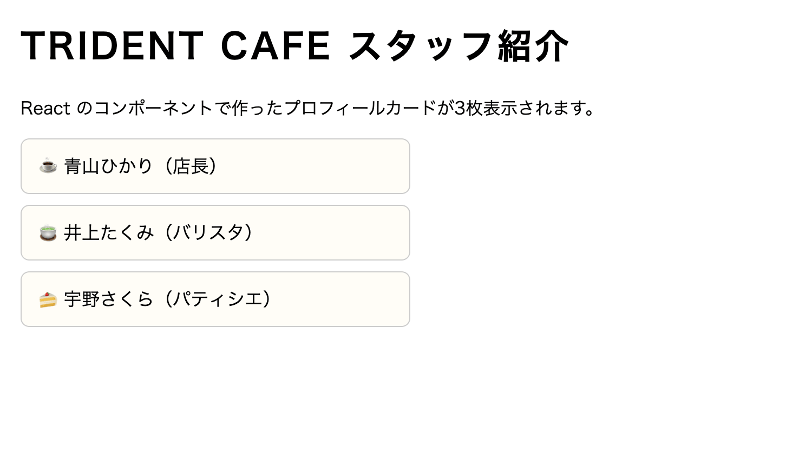

# jsQuiz-neo-10

**React 入門**です。ビルドツールなし（CDN だけ）で React を動かし、**コンポーネント**と **props** の基本を体験します。
jsQuiz09 でやった「分割代入」「テンプレートリテラルへの変数埋め込み」が、そのまま React の書き方につながります。

## 課題内容

カフェのスタッフ紹介ページです。`Profile` コンポーネントに props（名前・役職・絵文字）を渡して、プロフィールカードを3枚表示します。

**React の読み込み・`App` コンポーネント・画面への描画（`createRoot`）は `index.html` にすでに用意してあります。**
あなたの課題は、**`Profile` コンポーネントの `return null` を JSX に書き換えて完成させる**ことだけです。

### 完成イメージ



```
☕ 青山ひかり（店長）
🍵 井上たくみ（バリスタ）
🍰 宇野さくら（パティシエ）
```

### 用意済みの仕組み（書き換えないこと）

今回は npm でのインストールやビルドツールを使わず、**CDN だけで React を動かします**。

```html
<!-- ① import map：import に書く名前を CDN の URL に対応付ける表 -->
<script type="importmap">
  {
    "imports": {
      "react": "https://esm.sh/react@19",
      "react/jsx-runtime": "https://esm.sh/react@19/jsx-runtime",
      "react-dom/client": "https://esm.sh/react-dom@19/client"
    }
  }
</script>

<!-- ② Babel Standalone：ブラウザの中で JSX を普通の JS に変換するツール -->
<script src="https://cdn.jsdelivr.net/npm/@babel/standalone/babel.min.js"></script>

<!-- ③ JSX を書くスクリプト（type="text/babel" が目印） -->
<script type="text/babel" data-type="module" data-presets="react">
  import React from 'react';
  import { createRoot } from 'react-dom/client';
  ...
</script>
```

- **React 19 から UMD 版（`<script src>` でグローバル変数を作る形式）が廃止**されたため、ESM 対応 CDN の **esm.sh** から `import` します
- ブラウザの `import` は本来 `'react'` のような**名前だけの指定（裸のモジュール名）を解決できません**。**import map** がその名前を CDN の URL に対応付けてくれるので、実務（Vite などのビルドツール環境）と**同じ import 文**が書けます
- `react/jsx-runtime` のエントリは、Babel が JSX を変換したコードの中で**自動的に import される**モジュールです（消すと画面が真っ白になります）
- **JSX**（`<li>...</li>` を JS の中に直接書く記法）はブラウザがそのまま解釈できないので、**Babel Standalone** がページ内で変換しています。`type="text/babel"` が付いたスクリプトが変換対象です
- この方式は学習用です。実務では Vite などのビルドツールで**事前に**変換します

さらに `<script>` 内には以下が用意されています。

- `App` コンポーネント：あなたが作る `Profile` に **props を渡して**3枚並べる

  ```jsx
  function App() {
    return (
      <ul className="profile-list">
        <Profile name="青山ひかり" role="店長" emoji="☕" />
        <Profile name="井上たくみ" role="バリスタ" emoji="🍵" />
        <Profile name="宇野さくら" role="パティシエ" emoji="🍰" />
      </ul>
    );
  }
  ```

  props は「**HTML の属性のような書き方**」でコンポーネントに渡します。受け取る側（`Profile`）には、渡した値が**1つのオブジェクト**（`props`）にまとまって届きます。

- `createRoot(document.querySelector('#root')).render(<App />);` … `#root` に React アプリを描画する起動処理

### あなたの課題

`Profile` コンポーネントを完成させてください。骨組みはここまで用意してあります。

```jsx
function Profile(props) {
  const { name, role, emoji } = props;
  // ↓ ここを書き換える（課題）
  return null;
}
```

- `return null;` を、**JSX の return** に書き換えます：

  ```jsx
  return (
    <li className="profile-card">
      {emoji} {name}（{role}）
    </li>
  );
  ```

- 表示例: `☕ 青山ひかり（店長）`（丸かっこは全角の `（）`）

---

## 制作手順（ヒント）

### 1. コンポーネント＝「JSX を return する関数」

`Profile` はただの関数です。関数が return した JSX が、そのまま画面の部品になります。
**関数名の先頭は必ず大文字**（`profile` ではなく `Profile`）。小文字だと React が普通の HTML タグと区別できません。

### 2. props はオブジェクトで届く → 分割代入で受け取る

`<Profile name="青山ひかり" role="店長" emoji="☕" />` と書くと、`Profile` には

```js
props = { name: '青山ひかり', role: '店長', emoji: '☕' };
```

が届きます。骨組みの `const { name, role, emoji } = props;` は**オブジェクトの分割代入**です。
jsQuiz09 の `const [name, price, emoji] = item;`（配列版・`[ ]`）のオブジェクト版（`{ }`）で、**プロパティ名と同じ名前**の変数にまとめて取り出しています。

### 3. JSX への変数埋め込みは `{ }`（jsQuiz09 との違いに注意）

|              | jsQuiz09（テンプレートリテラル）                     | jsQuiz10（JSX）                            |
| ------------ | ---------------------------------------------------- | ------------------------------------------ |
| 全体         | `` `<li>...</li>` ``（バッククォートで囲む＝文字列） | `<li>...</li>`（囲まない＝文字列ではない） |
| 変数埋め込み | `${name}`                                            | `{name}`                                   |
| class 属性   | `class="..."`                                        | `className="..."`                          |

- JSX は**文字列ではない**ので、クォートやバッククォートで囲みません。囲むとただの文字がそのまま表示されます
- `class` は JS の予約語なので、JSX では `className` と書きます

### 4. 動作確認

`students/{自分の番号}/index.html` をブラウザ（**Chrome**）で開くだけで確認できます（http-server 不要。import が絶対 URL なので `file://` でも動きます）。
`return null;` のままだと何も表示されず、JSX に書き換えるとカードが3枚出ます。
うまく動かないときは、開発者ツール（F12）の Console のエラーを読んでください。Babel が JSX の文法エラーを教えてくれます。

---

## 提出方法

### ① Fork

このリポジトリを自分のアカウントに Fork してください。

### ② clone

自分の Fork を GitHub Desktop で clone します。

### ③ branch を作る

ブランチ名に「quiz10/自分の名前」を記入する（例：quiz10/kawaguchi）

### ④ コードを書く

`students/{自分の番号}/index.html` を編集して課題を完成させます。
（例：出席番号が 7 番なら `students/7/index.html`）

ルートの `index.html` を `students/{自分の番号}/index.html` にコピーしてから編集するのが簡単です。

### ⑤ commit / push

変更を commit して push してください。

- title：出席番号*名前（例：28*河口）
- message：提出します。

### ⑥ Pull Request を作成

元のリポジトリに向けて Pull Request を作成してください。

## 判定について

- Pull Request を出すと自動判定が実行されます
- 成功 → ✅ **合格！** のコメントが付きます
- 失敗 → ❌ **不合格** のコメントと確認ポイントが付きます

結果は PR のコメント欄と「Checks」タブで確認してください。

## ディレクトリ構成

```
jsQuiz-neo-10/
├── index.html              # 問題ファイル（参照・複製元）
├── students/               # 解答フォルダ ★ここに作業する
│   └── {自分の番号}/
│       └── index.html      # index.html を複製して解答を記述
├── .github/                # 自動判定の設定（触らない）
├── tests/                  # 自動判定の設定（触らない）
├── playwright.config.js    # 自動判定の設定（触らない）
└── README.md
```

## 注意

- `students/{自分の番号}/index.html` の `<script>` 内、**「ここから下があなたの課題です」〜「ここまでがあなたの課題です」の間**だけ編集してください
- 用意済みの処理（import map・React の import・`Profile` の骨組み＝分割代入の行・`App`・`createRoot`・自動判定用の処理）は書き換えないでください
- HTML構造（`#root`）やスタッフの名前・役職・絵文字は変更しないでください
- `students/` 以外のファイルは変更しないでください
- エラーが出たら修正して再度 push してください

---

## 模範解答

授業資料の[JSQuiz_neo模範解答](https://2026doc.hideok.org/first-term/javascript/post-quizanswer)
